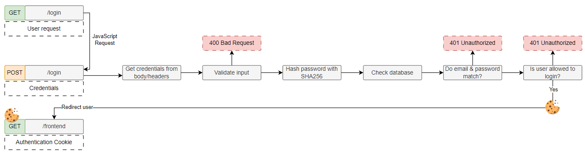
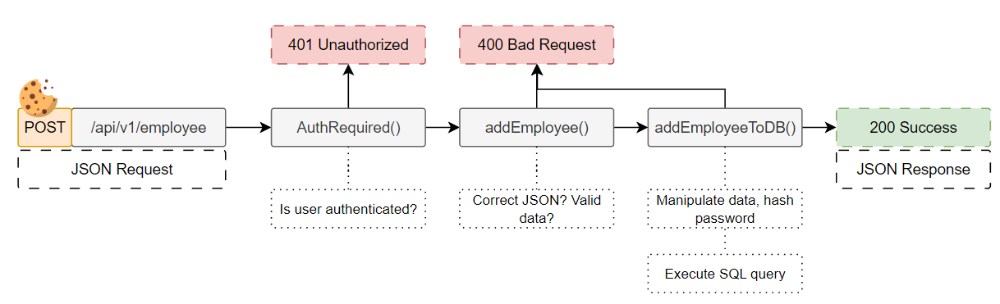

# HR-Applicatie

## Local setup
1. Install [Docker](https://www.docker.com/products/docker-desktop)
2. Clone the repository
3. Run `docker compose up --build`
4. Open your browser and go to `http://localhost:5000/healthcheck` to check the status of the application
5. Use software like [Postman](https://www.postman.com/) to test the API

### Default credentials
- Username: `admluka@holiday-parks.eu`
- Password: `6wh32OZqILO2gpExS3knZ3YdMbOl0B` 
"Credentals for all users must be 6wh32OZqILO2gpExS3knZ3YdMbOl0Bmin01 because of Azure AD doing the authentication"

URL: `http://localhost:5000/login`

## Powershell
There is an addon-script [example](test.ps1) that can be used to test the API. The script uses the `Invoke-RestMethod` cmdlet to send requests to the API. The script is a good example of how to use the API.

## Authentication
Cookie authentication is used to authenticate the user. The default credentials are listed above. The /login endpoint is used to authenticate the user with username and password and then gives a cookie back to the user. The cookie is used to authenticate the user on the other endpoints. The /logout endpoint is used to log out the user and remove the cookie from the server and client.

> Login endpoint API: `/login` -> POST

> Login endpoint Frontend: `/login` -> GET

> Logout endpoint: `/logout` -> GET

## Mock data
See [MOCKDATA.md](MOCKDATA.md) for the mock data that is used in the application for testing purposes.

## Flows

### Authentication

### Endpoints

## API documentation
The API documentation can be found at `http://localhost:5000/swagger/index.html`